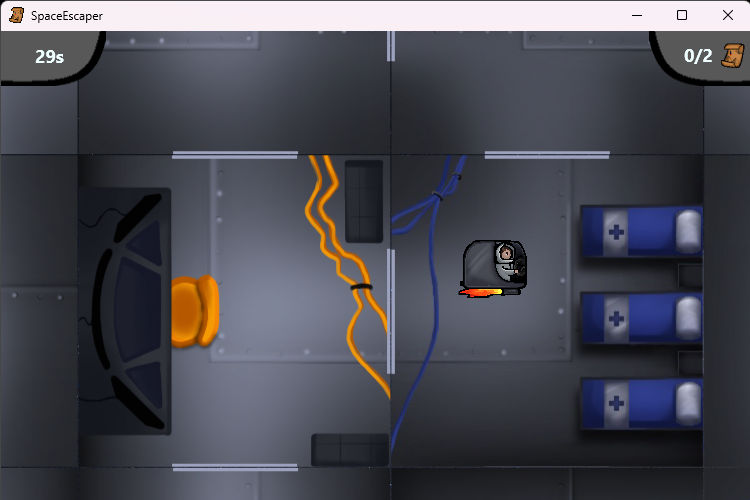
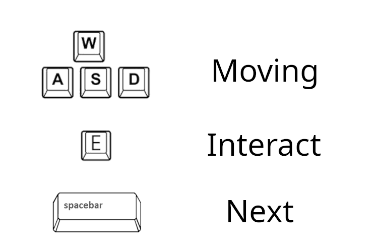

# SpaceEscaper

Small rouge-like game written in pascal using firemonkey. The Goal of the game is to collect random placed map pieces to escape a collapsing spaceship within a time limit.

    

# Controles

    

# Download
The compiled version for Windows can be found under releases.
 
The project can also be compiled independently by first downloading or cloning the repository using the green code button. Then the project file `SpaceEscaper.dpr` can be opened with the Delphi IDE. Here the project can be executed or compiled.

# Project structure
 - /src -> Source Files
 - /images -> Assets for the game
 - /frames -> Collection of GUI elements used together
 - /test -> Test Files